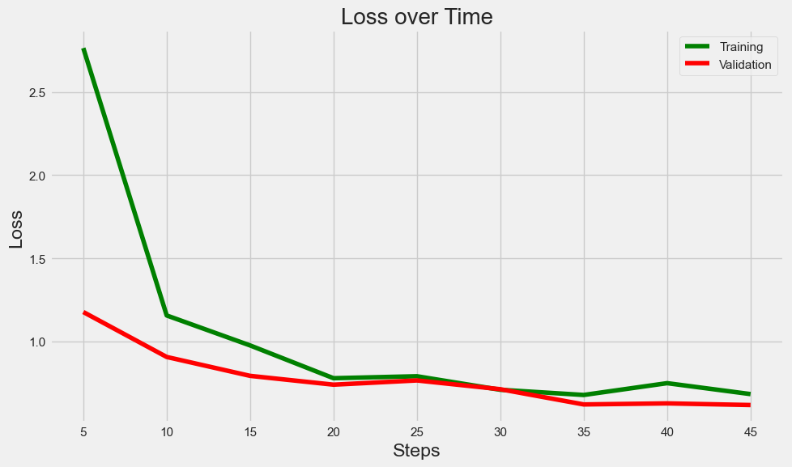
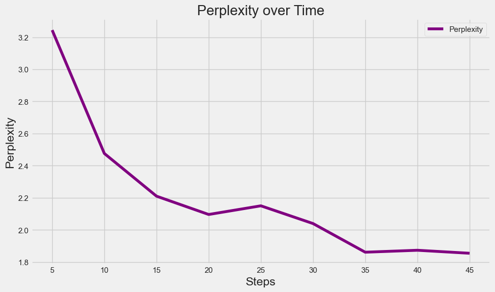
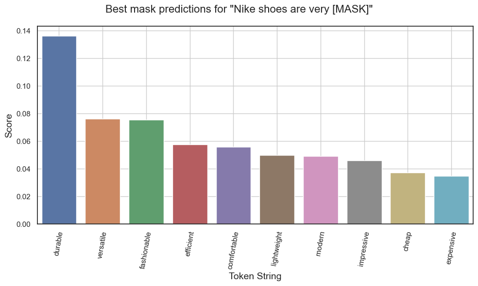

# An Introductory Guide to Fine-tuning Large Language Models

### What is a Large Language Model?

The term "Large Language Model" can be broken down into two parts.

A "Language Model" is a machine learning model trained to perform well on tasks related to text/language like Classification, Summarization, Translation, Prediction and Generation. With recent developments in this field, one can engage in long-form conversations, any-to-any language translation, sentiment and data analysis, question answering, etc on demand and for free! The potential use cases for Language Models are virtually unlimited. As technology evolves and research continues, we expect even more innovative applications to emerge.

The "Large" part signifies that LLMs are deep learning algorithms. They have millions to billions (and now even trillions, as in the case of GPT-4) of trainable parameters. This massive amount of parameters enables LLMs to achieve exceptional performance across a wide range of tasks.

Today, a growing number of LLMs are gaining recognition, including GPT (most notably, ChatGPT), Codex, BLOOM, BERT, LLaMA, LaMDA, and PaLM. To enable the development and training of these complex models, large technology companies are leading the way as they possess the infrastructure and expertise. These companies possess the know-how and computational resources to train and fine-tune models, allowing them to achieve impressive results across a wide range of natural language processing tasks.

---

### History of Large Language Models

LLMs have had significant evolution since their origin. The first models were shallow and relied on the n-gram technique that just counted occurrences of words or phrases. Later on, neural language models came about, such as recurrent neural networks (RNNs, LSTMs and GRUs) that enabled more complex models to rise.

One of the most significant advancements in LLMs came about in 2017 when the "Transformer" architecture was introduced in the paper "Attention Is All You Need". It enabled the training of deep neural nets to become highly parallelizable compared to previous techniques. The attention mechanism introduced not only enabled the development of LLMs with billions of parameters but also found its way into multiple other areas. With the ongoing R&D in this area, models will likely become even more powerful and versatile in the future.

BERT, which is one such model based on transformer architecture, is what we will be looking at for demonstration and fine-tuning in this blog.

---

### What is Fine-tuning?

Fine-tuning is the process of taking a pre-trained language model and further training it on a specific task, such as sentiment analysis, to improve its performance on that particular task. This is achieved by taking the pre-trained model and training it on a smaller dataset that is specific to the task. It allows the model to adapt its existing knowledge rather than having to learn everything from scratch.

In this blog, we will look at fine-tuning BERT (a language model developed by Google), which has been pre-trained on a large corpus of text, allowing it to capture a wide range of language patterns and contextual relationships. The task that we will be fine-tuning is Masked Language Modelling.

---

### What is Masked Language Modelling?

MLM (Masked Language Modelling) is a task which involves masking/removing some of the words in a sentence and making the model predict those words based on remaining contextual information. Think of it as adding blanks to a sentence to create fill-in-the-blanks-style questions. In BERT, this is used as a pre-training task to allow it to gain a general understanding of the language. Masking involves randomly or algorithmically replacing words with a special `[MASK]` token.

An example of masking is as follows:

**Original Text**: There are so many discoveries and advancements in the field of AI and ML these days. What a time to be alive!

**After Masking**: There are so many [MASK] and advancements in the field of AI and [MASK] these days. What a time to be [MASK]!

**Probable Mask Prediction**: There are so many [innovations] and advancements in the field of AI and [technology] these days. What a time to be [alive]!

---

### Getting started with BERT

Access to models like BERT has been made very easy over the years, thanks to platforms like Hugging Face, which provides a user-friendly interface for accessing and utilizing pre-trained language models. They also offer a wide range of pre-trained models and tools for fine-tuning them on specific tasks. With Hugging Face, even those without a deep understanding of machine learning can easily use pre-trained models like BERT to improve the performance of their NLP applications.

Let's dive into some code and get our hands dirty with BERT. The prerequisites are a working installation of Python and some experience using it.

#### Step 1 - Installing Required Libraries and Basics

Start by installing all the required libraries that we will use throughout the example.

```
pip install torch 'transformers[torch]' datasets ipywidgets nltk matplotlib==3.6.0 seaborn uptrain
```

Create a Python file or Jupyter notebook with the following code:

```python
import json
from transformers import pipeline

masked_sentence = "There are so many [MASK] and advancements in the field of AI and [MASK] these days. What a time to be [MASK]!"
fill_masker = pipeline(model="distilbert-base-uncased")
print(json.dumps(fill_masker(masked_sentence), indent=2))
```

Look at how simple the code is for getting started with MLM!

Instead of BERT, the above code uses DistilBERT - a smaller, faster and almost equally performant model. The pipeline invokes the model and retrieves the top 5 (can be changed by passing the `top_k` attribute that defaults to 5) predictions for each mask. Since there are three masks, the model will return a total of 15 predictions (5 for each word). The output is as follows:

<details>
<summary>Output</summary>
<br />

```json
[
  [
    {
      "score": 0.16455209255218506,
      "token": 15463,
      "token_str": "innovations",
      "sequence": "[CLS] there are so many innovations and advancements in the field of ai and [MASK] these days. what a time to be [MASK]! [SEP]"
    },
    <TRUNCATED>
  ],
  [
    {
      "score": 0.02868303284049034,
      "token": 2974,
      "token_str": "technology",
      "sequence": "[CLS] there are so many [MASK] and advancements in the field of ai and technology these days. what a time to be [MASK]! [SEP]"
    },
    <TRUNCATED>
  ],
  [
    {
      "score": 0.023737657815217972,
      "token": 5541,
      "token_str": "creative",
      "sequence": "[CLS] there are so many [MASK] and advancements in the field of ai and [MASK] these days. what a time to be creative! [SEP]"
    },
    <TRUNCATED>
  ]
]
```

</details>

As can be seen from the output, the model assigns a confidence "score" for different predictions. It then sorts them based on this score. The higher score predictions show up in the top_k outputs.

---

### Fine-tuning Task

Since we'd like to fine-tune BERT, we need to define the task at which we want to make it better. Our goal is to bias the masked word predictions to have more positive sentiment in the context of product reviews at Nike. We can do so by providing the model with some labelled data to retrain, where each sentence has a corresponding positive or negative sentiment.

In simpler words, let's say we have the sentence - "Nike shoes are very [MASK]". The predictions that we want for the masked token here are "popular", "durable", "comfortable" as opposed to "expensive", "ugly", "heavy".

#### Step 2 - Collecting/Synthesizing Datasets

For this task, we need a dataset that contains sentence examples of the above format. We could use an online dataset, but for the sake of this example, let's synthesize our own. To put it simply, we create sentence templates with predetermined structures and insert specific words like adjectives or products into them to generate sentences. While some of the resulting sentences may not make complete sense, it is not a significant issue for this task as long as we convey enough information to the model. We can perform the data synthesis using the pseudocode below. For the sake of the simplicity of this blog, we haven't included the exact source code here. However, all relevant code can be found [here](https://github.com/uptrain-ai/uptrain/blob/main/examples/finetuning_LLM/).

<details>
<summary>Code</summary>
<br />

```python
PRODUCTS = <List of Products manufactured by Nike>

POSITIVE_SENTIMENT_ADJECTIVES = <List of Positive Sentiment Adjectives>

NEGATIVE_SENTIMENT_ADJECTIVES = <List of Negative Sentiment Adjectives>

ADJECTIVES = POSITIVE_SENTIMENT_ADJECTIVES + NEGATIVE_SENTIMENT_ADJECTIVES

COMPANIES = <List of companies that make sports gear>

JOINERS = <Joiner phrases in English> # for example: are famous for, offer, etc.

def create_sample_dataset(dataset_size: int):
    data = []
    
    for i = 1 to dataset_size:
        sentence = randomly generate a sentence using COMPANIES, JOINERS, PRODUCTS, and sentiment adjectives
        label = positive or negative depending on adjective used in sentence
        data.append((sentence, label))
    
    # Since we're synthesizing our own dataset and not a real-life dataset, let's
    # nullify some values because real-life datasets will usually also have null
    # data. This can be monitored with UpTrain which we will be looking into later
    randomly nullify 5% of the sentence text in data
    return data
```

</details>

To perform data synthesis, we need some basic setup and helper functions. Again, you can find the entire source code for reference using the shared link above. With all of that setup, we can synthesize our data.

<details>
<summary>Code</summary>
<br />

```python
SYNTHESIZED_DATASET_SIZE = 25000
dataset = create_sample_dataset(SYNTHESIZED_DATASET_SIZE)
save(dataset)
```
</details>

Let's also create a list of sentences that we will use to test and evaluate our model's performance before and after fine-tuning, similar to the initial example above.

<details>
<summary>Sentence List</summary>
<br />

```python
testing_texts = [
    "Nike shoes are very [MASK]",
    "Nike athletic wear is known for being very [MASK]",
    "Nike [MASK] shoes are very comfortable",
    "Trousers and Hoodies made by [MASK] are not very expensive",
    "Nike tshirts are famous for being [MASK]"
]
```
</details>

#### Step 3 - Integrating UpTrain

Now that we have our dataset and a list of sentences for testing, we could try fine-tuning our model, but it will not improve the performance much. The model will be fed both positive and negative sentiment data and it may not learn to prioritize the positive sentiment predictions as expected in our fine-tuning task. This is where UpTrain comes in. With just a few lines of code, one can define a "Signal", which can be used as a filter for the dataset. It has other use cases as well, which you can find by checking out the UpTrain repository. Let's take a look at how to use UpTrain signals.

In the pseudocode below, we define three functions. These functions are callbacks that UpTrain signals will use to determine whether some data from our dataset is relevant to our task at hand. We can chain multiple signals as well as mix and match them by using `&` (combining signals logically with the AND operator) and `|` (combining signals logically with the OR operator) operators.

<details>
<summary>Code</summary>
<br />

```python
def nike_text_present_func (inputs, outputs, gts=None, extra_args={}):
    """Checks if the word "Nike" is present in the text or not"""
    is_present = []
    for sentence in inputs:
        is_present.append(bool(sentence contains "nike"))
    return is_present

def nike_product_keyword_func (inputs, outputs, gts=None, extra_args={}):
    """Checks if the sentence contains a product associated with Nike or not"""
    is_present = []
    for sentence in inputs:
        is_present.append(bool(sentence contains a product associated with Nike))
    return is_present

def is_positive_sentiment_func (inputs, outputs, gts=None, extra_args={}):
    """Determines if an input sentence has a positive sentiment or not"""
    is_positive = []
    for sentence in inputs:
        is_present.append(bool(sentence has positive sentiment))
    return is_positive

# Define the UpTrain Configuration
cfg = {
    # Define checks that should be performed on the data
    'checks': [
        {
            "type": uptrain.Monitor.EDGE_CASE,
            "signal_formulae": \
                uptrain.Signal("Is 'Nike' text present?", nike_text_present_func) &
                uptrain.Signal("Is it a Nike product?", nike_product_keyword_func) &
                uptrain.Signal("Is positive sentiment?", is_positive_sentiment_func)
        },

        {
            "type": uptrain.Monitor.DATA_INTEGRITY,
            "measurable_args": {
                "type": uptrain.MeasurableType.INPUT_FEATURE,
                "feature_name": "text"
            },
            "integrity_type": "non_null"
        }
    ],

    # Define where to save the retraining dataset
    "retraining_folder": uptrain_save_fold_name,
    
    # Define when to retrain; define a large number because we
    # are not retraining yet
    "retrain_after": 10000000000,

    "logging_args": {"st_logging": True},
}

dashboard_name = "llm_bert_example"
framework = uptrain.Framework(cfg)
```

</details>

The explanation for the above code can be found after the completion of Step 4.

#### Step 4 - Generating Fine-tuning Dataset using UpTrain

With the framework defined, we can process our dataset with UpTrain using the pseudocode below. It is a simple loop that iterates over all our data in the dataset and passes it into the framework.

<details>
<summary>Code</summary>
<br />

```python
for sample in dataset:
    # We are processing data one at a time but note that you can pass data in
    # batches too by providing more than one value in the list
    inputs = { 'text': [ sample['text'], ] }
    framework.log(inputs=inputs)

retraining_dataset = load_dataset(uptrain_save_fold_name)
```

</details>

There are a few things to look at here. UpTrain provides different Monitors for monitoring performance, checking for data distribution shifts, and collecting edge cases to retrain upon, among other things. Here, we use the EDGE_CASE monitor and provide it with our signals. We also add a data integrity check to ensure that none of our data contains null values. All monitoring-related activities will show up on UpTrain's live dashboard. Once processing completes, we will have created a retraining dataset that contains only those sentences that satisfy the requirements of the signals above. This dataset is not only smaller than the original (whether it be synthesized or obtained from a reliable source) but also contains only specific data that is relevant to the fine-tuning task.

#### Step 5 - Fine-tuning the model

Now that we have our retraining dataset tailored to our objective, we can begin with the retraining/fine-tuning process. HuggingFace offers user-friendly APIs that simplify the training and fine-tuning of models. If you wish to understand how to do this for the above example, please refer to the complete source code available [here](https://github.com/uptrain-ai/uptrain/blob/main/examples/finetuning_LLM/).

#### Step 6 - Evaluation and Visualization

After fine-tuning, we can visualize the different metrics used to study the performance of large language models. Two such metrics that we'll take a look at are [training/validation loss](https://en.wikipedia.org/wiki/Training,_validation,_and_test_data_sets) and [perplexity](https://www.wikiwand.com/en/Perplexity).

**Loss Plot**



**Perplexity Plot**



The code for plotting is available in the linked notebook above. We can see that the model's performance on our fine-tuning dataset improves with time as the values for both the loss and perplexity decrease. This is great!

Let's see the model's predictions on our pre-defined test sentences and verify whether the model became better at our defined fine-tuning task.

<details>
<summary>Predictions</summary>
<br />

```
                Text: Nike shoes are very [MASK]
 Original Top tokens: ['popular', 'durable', 'expensive', 'comfortable', 'fashionable']
Fine-tuned Top tokens: ['durable', 'versatile', 'fashionable', 'efficient', 'comfortable']

                Text: Nike athletic wear is known for being very [MASK]
 Original Top tokens: ['durable', 'expensive', 'popular', 'fashionable', 'rare']
Fine-tuned Top tokens: ['durable', 'fashionable', 'lightweight', 'efficient', 'flexible']

                Text: Nike [MASK] shoes are very comfortable
 Original Top tokens: ['polo', 'golf', 'swim', 'tennis', 'nike']
Fine-tuned Top tokens: ['training', 'basketball', 'soccer', 'running', 'football']

                Text: Trousers and Hoodies made by [MASK] are not very expensive
 Original Top tokens: ['women', 'manufacturers', 'men', 'amateurs', 'slaves']
Fine-tuned Top tokens: ['nike', 'honda', 'samsung', 'yamaha', 'bmw']

                Text: Nike tshirts are famous for being [MASK]
 Original Top tokens: ['.', ':', ';', 'colorful', 'unique']
Fine-tuned Top tokens: ['inexpensive', 'cheap', 'lightweight', 'versatile', 'durable']
```

</details>

We can see from the above output that the model is doing much better at predicting masked words with positive sentiment associated with them. In the first example, the model no longer predicts masked words such as "expensive" among its top 5 predictions, which is exactly what we want! An interesting case to look at is the predictions for example 3. We no longer have swim shoes!

We can also visualize the mask prediction confidence for different predictions, which is a helpful way of visualizing what words the model thinks are good substitutions. The code for this can be found in the linked notebook.



---

And with that, we have learnt how to fine-tune a Large Language Model as well as how to use UpTrain for improving model performance and monitoring!

In conclusion, fine-tuning large language models like BERT can be a powerful tool for solving specific natural language processing tasks. UpTrain provides a simple and easy-to-use interface that requires minimal code to perform model monitoring, data drift checks, data integrity checks, edge case detection, model bias tracking, custom metric monitoring and much more. Check out the UpTrain repository [here](https://github.com/uptrain-ai/uptrain).
